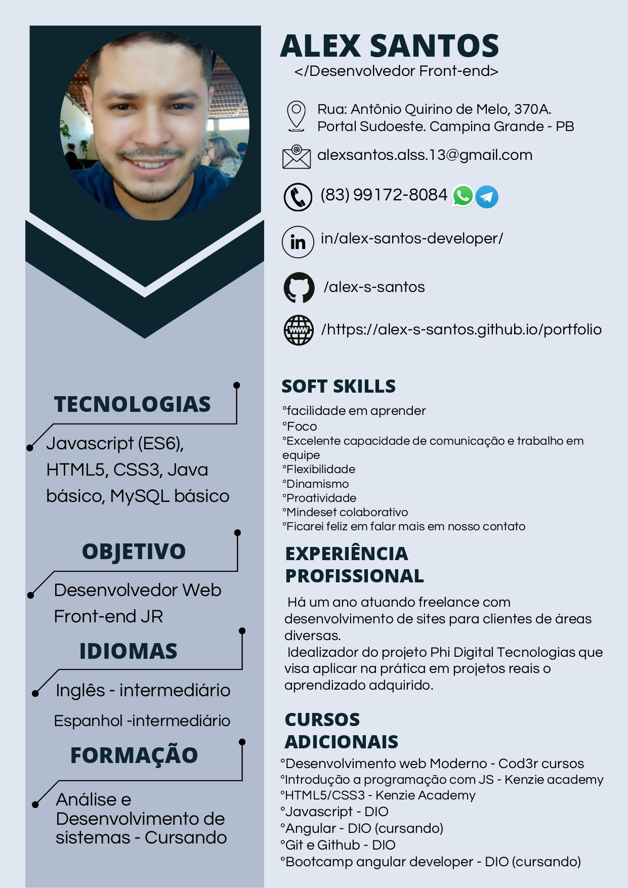

<h1>Projeto currículo usando HTML e CSS</h1>

Reproduzindo um currículo com HTML e CSS para praticar as stacks. O objetivo é deixar mais parecido com o modelo, deixando-o responsívo.

<h2>Modelo</h2>

<h3>Colaboradores</h3>

<ul>
<li>Alex Santos</li>
<li>Desenvolvedor web front-end</li>
<li>Formado em análise e desenvolvimento de sistemas pela Unipê</li>
<li>Estudando Java, react, NodeJs, SQL</li>
</ul>